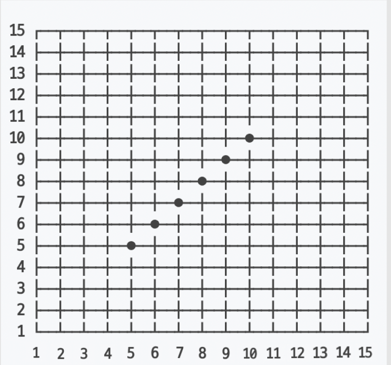

## Contributors

<div style="text-align: center;">

This library is not yet complete.  
If you find a bug, please report it via PR.

### Contributors to the budool Renju Rule library

<a href="https://github.com/tmdgh1592/budool-omok-rule/graphs/contributors">
  
</a>

---

</div>

## omok-rule

A library that can check `Renju rules` of `omok` such as 3-3, 4-4, and longline(jangmok)



The `x-axis` is `Col`.  
The `y-axis` is `Row`.  
For example, In the picture above, the black stones are placed
at `(5, 5)`, `(6, 6)`, `(7, 7)`, `(8, 8)`, `(9, 9)`, `(10, 10)`.

---

### How to use

If you want to use the omok `Renju rule`, simply add the dependency below.
If you prefer it, you can use the gradle dependency, you have to add these lines in your `build.gradle.kts` file:

```kotlin
repositories {
    ...
    maven { url = uri("https://jitpack.io") }
}

dependencies {
    val currentVersion = "v1.0.2-alpha"
    implementation("com.github.tmdgh1592:budool-omok-rule:$currentVersion")
```

---

## Point.kt

Converts the current position `row`, `column` to a Point object.  
Point object is used to check Renju rule.

```kotlin
data class Point(val row: Row, val col: Col)
```

---

## OmokRule.kt

OmokRule has `BlackRenjuRule.kt` and `WhiteRenjuRule.kt` as subclasses.

### constructor

`boardWidth` : the width of the game board.  
`boardHeight` : the height of the game board.

```kotlin
// default board size is 15 by 15.
val omokRule = BlackRenjuRule(15, 15) // Create 15x15 board
```

### checkWin()

This method determines if you win when you place a stone.
Returns `True` if there are 5 or more stones in a row without any fouling. otherwise return `False`.

```kotlin
val omokRule: OmokRule = BlackRenjuRule() // or WhiteRenjuRule()
val blackPoints: List<Point> = listOf(Point(3, 3), Point(4, 4), Point(5, 5), Point(6, 6))
val whitePoints: List<Point> = listOf(Point(3, 4), Point(4, 3))
val startPoint: Point = Point(row = 7, col = 7)

val result = omokRule.checkWin(blackPoints, whitePoints, startPoint)
```

### checkAllFoulCondition()

This is a method to check all foul condition including `double three (3-3)`, `double four (4-4)`
and `overline(jangmok)`.  
If any of the above rules are applicable, `KoRule.KO_ALL` is returned.  
Otherwise, it returns `KoRule.NOT_KO`.

```kotlin
val omokRule: OmokRule = BlackRenjuRule() // or WhiteRenjuRule()
val blackPoints: List<Point> = listOf(Point(3, 3), Point(4, 4))
val whitePoints: List<Point> = listOf(Point(3, 4), Point(4, 3))
val startPoint: Point = Point(row = 5, col = 5)

// Since none of the rules apply, KoRule.NOT_KO is returned.
// if omokRule type is WhiteRenjuRule, it returns always KoRule.NOT_KO.
val result = omokRule.checkAllFoulCondition(blackPoints, whitePoints, startPoint)
```

### checkDoubleFoul()

This is a method to check `double three (3-3)` or `double four (4-4)`.  
if it is a double foul, returns `KoRule.KO_DOUBLE_THREE` or `KoRule.KO_DOUBLE_FOUR`.
Otherwise, if it is not a double foul, returns `KoRule.NOT_KO`.

```kotlin
val omokRule: OmokRule = BlackRenjuRule() // or WhiteRenjuRule()
val blackPoints: List<Point> = listOf(Point(3, 3), Point(4, 4))
val whitePoints: List<Point> = listOf(Point(3, 4), Point(4, 3))
val startPoint: Point = Point(row = 5, col = 5)

// double foul type you want to check
val foul: Foul = Foul.DOUBLE_THREE // or -> val foul: Foul = Foul.FOUR_THREE

// if omokRule type is WhiteRenjuRule, it returns always KoRule.NOT_KO.
val result = omokRule.checkDoubleFoul(blackPoints, whitePoints, startPoint, foul)
```

### checkOverline()

This is a method to check if it is `overline(jangmok)`.
if if there are more than 6 stones on the board in a row, returns `KoRule.KO_OVERLINE`.  
Otherwise, if there are less than 6 stones, returns `KoRule.NOT_KO`.

```kotlin
val omokRule: OmokRule = BlackRenjuRule()
val stonesPoints: List<Point> = listOf(Point(1, 1), Point(2, 2), Point(3, 3), Point(5, 5), Point(6, 6))
val startPoint: Point = Point(4, 4)

// result is KoRule.KO_OVERLINE
// if omokRule is WhiteRenjuRule, it returns always KoRule.NOT_KO.
val result = omokRule.checkOverline(stonesPoints, startPoint)
```
